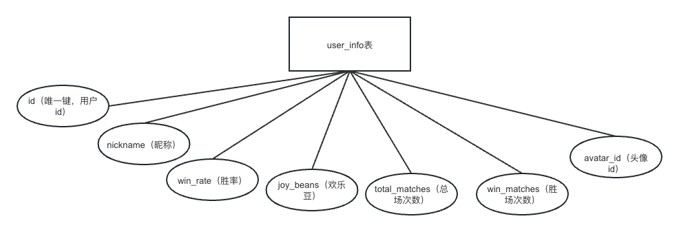

# 第一周

## 任务汇总及划分

### 任务汇总

1、完成整体框架图（附录有实例）

2、产出登录注册模块时序图（附录有实例）

3、登录注册模块整理并正常运⾏

4、熟悉⼯具及引擎使⽤

* 客户端引擎：cocos2d-x 3.17.2 及 MVC框架结构

* 框架图、流程图、时序图绘制⼯具：OmniGraffle

* 脑图⼯具：XMind

* GIT⼯具：Sublime Merge、Sourcetree

* Mac集成开发⼯具：XCode

* 消息协议：Google Protocol Buffer

# 第二周

## 任务汇总及划分

### 任务汇总
1、个人信息功能
2、对局（房间）模块
3、游戏模块

# 第三周

## 任务汇总及划分

### 任务汇总

1、匹配模块
2、对局模块

# 第四周

## 任务汇总及划分

### 任务汇总

1、bug修复

2、功能优化

3、计时器功能

4、 断链后人机接管


## 规范统一及连接密码

### git提交规范

主要统一的是`commit`信息：

```
代码所在的端:
[client]:客户端
[server]:服务端
[project]:文档修改
修改代码的目的:
[doc]:文档修改
[refactor]:代码重构
[feature]:功能模块
[enhancement]:给功能模块添加新功能或者新代码
提交示例:
[client][feature] login finished!
```

## 客户端功能分析

将页面进行拆分为注册登录页面、游戏大厅页面、游戏页面，下面依次是三个页面的功能点分析：


游戏大厅页面功能点：


游戏界面功能点：


对局思维导图：


设置界面思维导图：


人机对战思维导图：


## 框架图


## UI原型图

游戏大厅原型图：


个人中心原型图：


游戏界面原型图：


## 甘特图


## 注册登录需求

### 业务流程图

注册流程图：


登录流程图：


修改信息流程图：


签到流程图：


匹配流程图：


对局流程图：


判断胜利流程图


人机对战流程图


### 技术时序图

注册时序图：


登录时序图：


修改信息时序图：


匹配时序图：


对局时序图：


结算时序图：


落子和判断胜利时序图


认输时序图


### 数据库设计

首先创建数据库：

```sql
CREATE DATABASE wzq2;
```

### 表设计

user表设计：

```
user表：
id：主键索引，，auto_increment
用户名：字符串类型，唯一键
密码：字符串类型
```

设计图：


创建语句：

```sql
-- 创建 user 表
CREATE TABLE user (
    id INT PRIMARY KEY AUTO_INCREMENT COMMENT '主键索引',
    username VARCHAR(255) UNIQUE COMMENT '用户名，唯一键',
    password VARCHAR(255) COMMENT '密码'
);
```


user_info表设计：

```
user_info表：
id:唯一键索引
昵称：字符串类型，可以存储中文
胜率：浮点型
欢乐豆：整型
总场次数：整型
胜场次数：整型
```

设计图：



创建语句：

```sql
-- 创建 user_info 表
CREATE TABLE user_info (
    id INT UNIQUE COMMENT '唯一键索引',
    nickname VARCHAR(255) COMMENT '昵称，可以存储中文',
    win_rate FLOAT DEFAULT 0 COMMENT '胜率',
    joy_beans INT DEFAULT 0 COMMENT '欢乐豆',
    total_matches INT DEFAULT 0 COMMENT '总场次数',
    win_matches INT DEFAULT 0 COMMENT '胜场次数',
    avatar_id INT DEFAULT 0 COMMENT '头像id'
);
```

redis中签到表设计：

```
表key值：WZQ_USER_CHECK_IN_INFO
表的类型：哈希表
哈希表存储数据：key:id value:上一次签到时间的时间戳
```

## 大厅模块开发

### 消息协议规范


#### 申请修改个人信息

```protobuf
message REQAlterInfo
{
    optional int32 id=1;
    optional bytes nickname=2;
    optional int32 avatar=3;
    optional int32 sex=4;
}

message ACKAlterInfo
{
    optional int32 code   = 1;
    optional bytes nickname=2;
    optional int32 avatar=3;
    optional int32 sex=4;
}
```

#### 申请修改密码

```protobuf
message REQAlterPwd
{
    optional int32 id=1;
    optional bytes originpwd=2;
    optional bytes newpwd=3;
}

message ACKAlterPwd
{
    optional int32 code   = 1;
}
```

